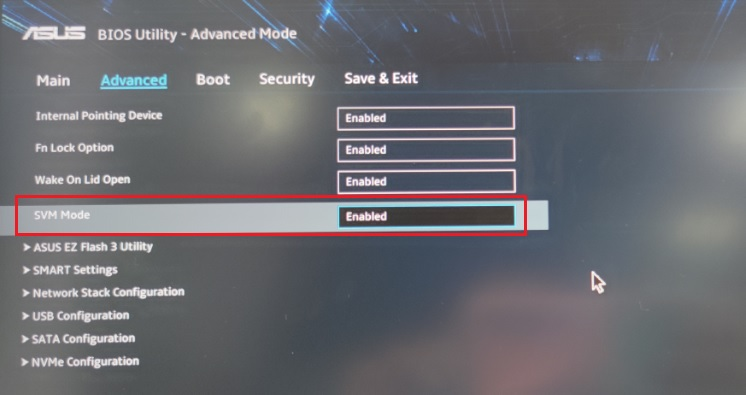
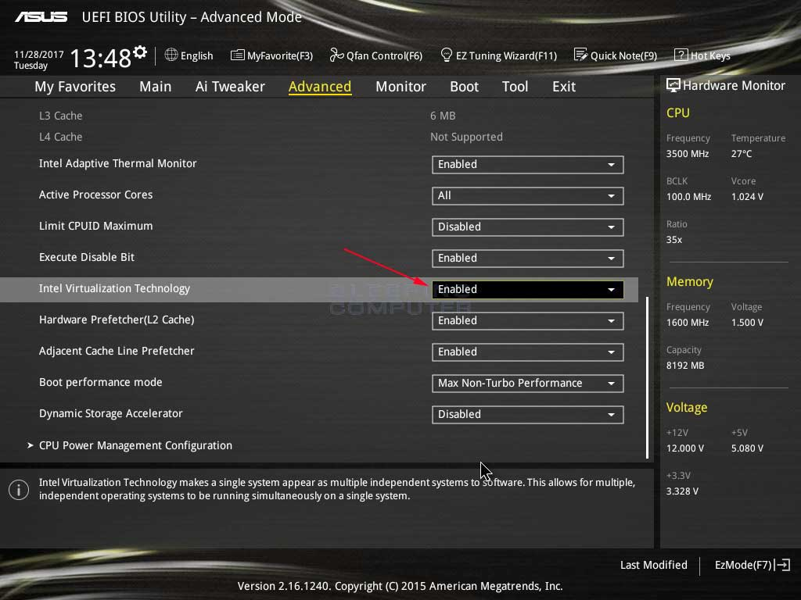
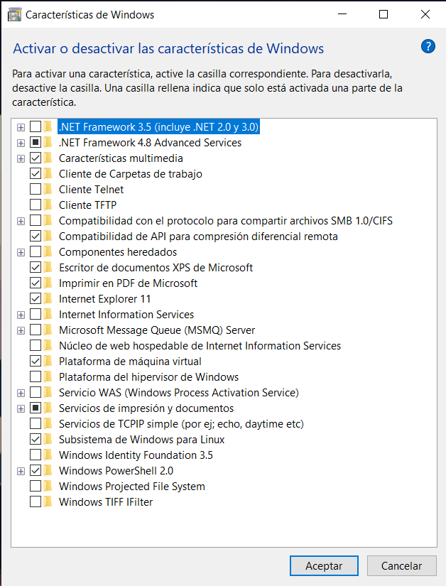
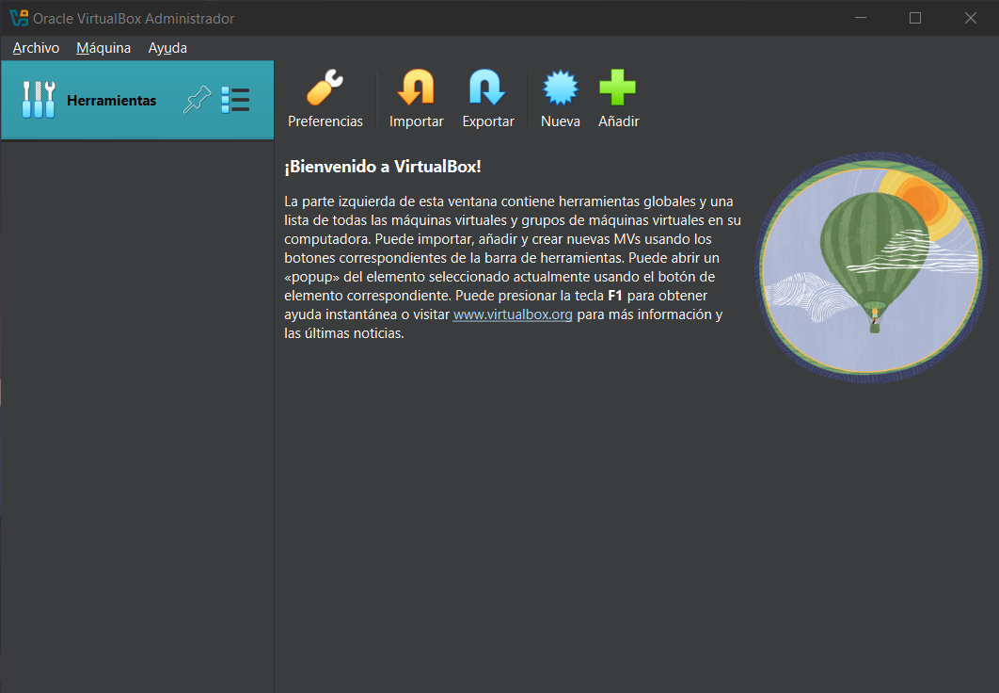
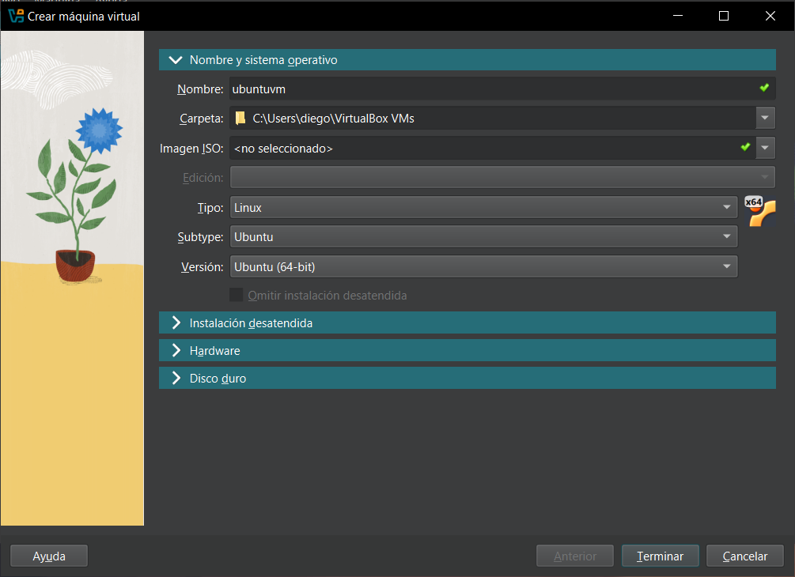
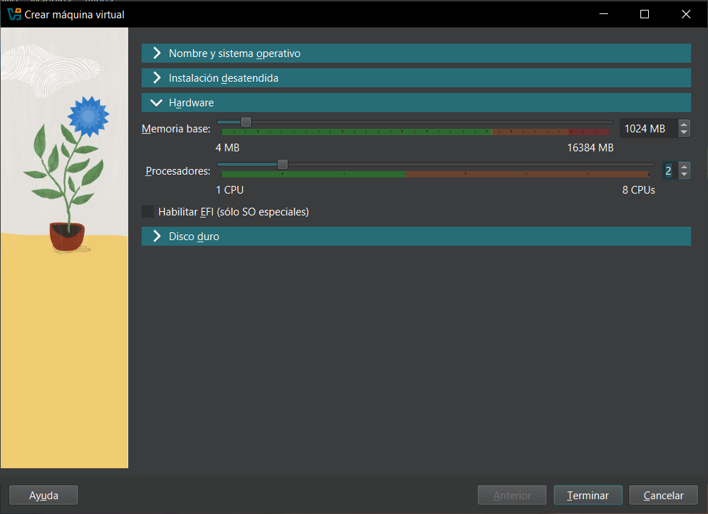
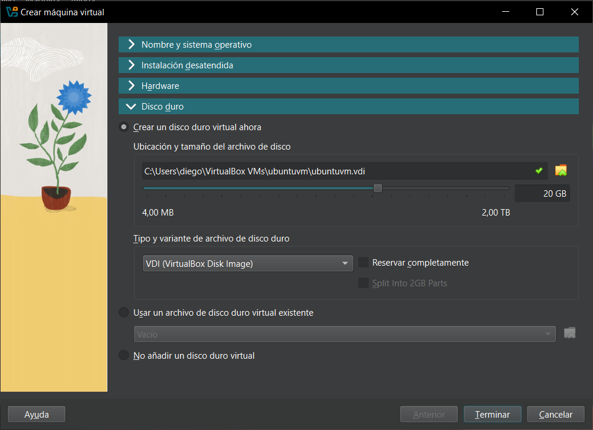
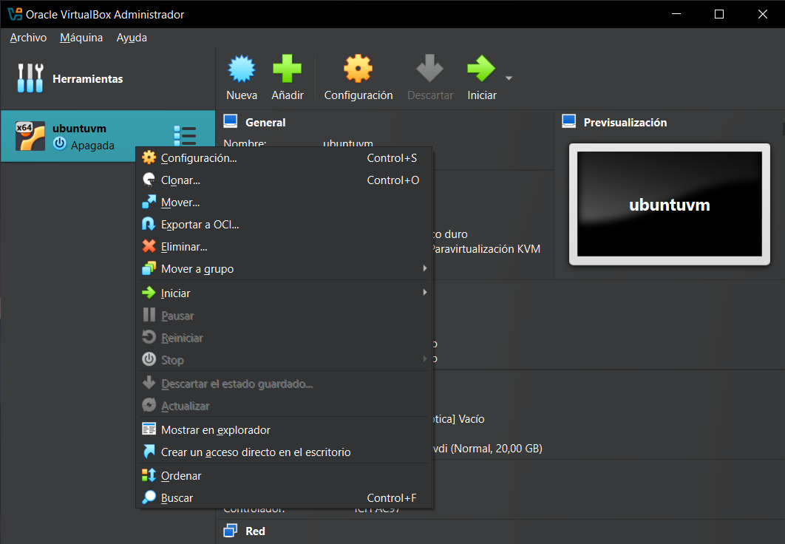
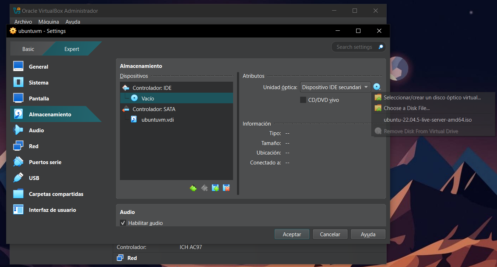
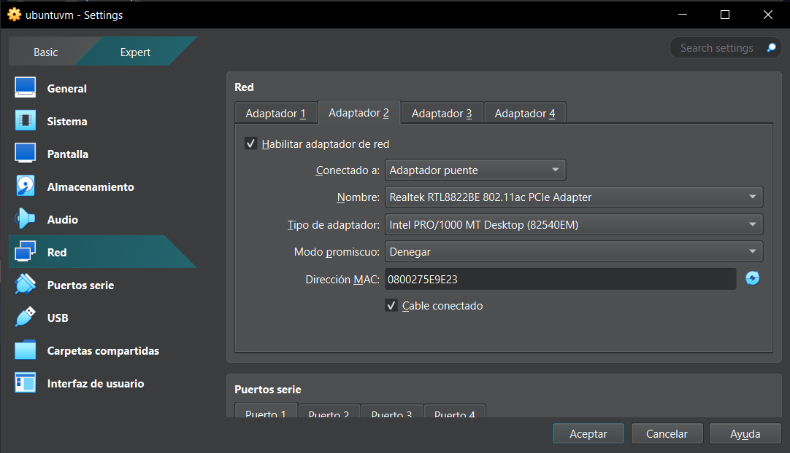

### 📝 Configuración Manual de Máquinas Virtuales

-----

#### 👨‍🏫 Hola y bienvenidos

En éste README encontrarás información útil para aprovisionar tu primera máquina virtual manualmente.

-----

### 📋 Requisitos Previos (Solo para Windows)

Antes de empezar, debemos cumplir algunos requisitos previos. Esto es **sólo para Windows**. Si usas macOS ó Linux, no encontrarás esta opción.

1.  **Activar la virtualización en la BIOS:**

      * No es un ajuste del sistema operativo, sino de la BIOS.
      * Para acceder, reinicia tu ordenador y pulsa la tecla correspondiente (F2, F12, Supr, Escape) según el fabricante (HP, Lenovo, etc.).
      * Busca una opción llamada `VTx`, `Secure Virtual Machine` o `Virtualization` y habilítala.
      * Guarda los cambios y sal de la BIOS para que el ordenador se reinicie.
      * Ejemplos de nombres: `Intel Virtualization Technology`, `VTx`, `SVM mode`.

<p align="center">
  
</p>

<p align="center">
  
</p>

2.  **Desactivar características de Windows:**

<p align="center">
  
</p>

* Busca "Activar o desactivar las características de Windows" en el menú de inicio.
      
  * Desmarca las siguientes opciones:
          * `Plataforma Microsoft Hyper-V` o `Windows Hypervisor`.
          * `Subsistema de Windows para Linux`.
          * `Plataforma de máquina virtual`.
  * Haz clic en "Aceptar" y reinicia tu ordenador.


**Resumen:** Activa `VTx` en la BIOS y desactiva las características de Windows mencionadas.

-----

### ⚠️ Solución de Problemas Comunes

  * **La VM no obtiene una dirección IP:** Esto suele ocurrir por culpa del router.
      * **Solución (como medida de precaución):**
        1.  Apaga el ordenador.
        2.  Reinicia el router.
        3.  Enciende el ordenador.
      * Esto no es obligatorio, pero es una buena precaución.

-----

### ⚙️ Parte 1: Provisionamiento manual de VMs

#### Paso 1: Crear una VM Ubuntu

1.  Abre **Oracle VirtualBox**.
2.  Haz clic en "Nueva" (Icono de engranaje)
<p align="center">
  
</p>

4.  **Nombre:** `ubuntuvm` (o el que prefieras).
5.  **Ubicación:** Elige dónde guardar la VM.
6.  **Tipo:** `Linux`.
7.  **Sub-Type:** `Ubuntu`.
8.  **Versión:** `ubuntu (64-bit)`.
<p align="center">
  
</p>


* 🚨 **Importante:** Si no ves la opción de 64 bits, significa que la virtualización (VT) no está habilitada en tu BIOS.


#### Paso 2: Asignar Hardware

1.  **Memoria RAM:** `2048 MB` (2 GB). Puedes usar `1024 MB` (1 GB) si tienes pocos recursos.
2.  **CPU:** `2` procesadores (ó menos dependiendo de tu Equipo).
3.  **Disco Duro:**
      * Crea un disco duro virtual.
      * **Tamaño:** `20 GB` (20 GB es lo mínimo recomendable).
      * Asegúrate de que la opción "Reservar completamente" **no** esté marcada para que el espacio se asigne dinámicamente.
4.  Haz clic en "Finalizar".

<p align="center">
  
</p>
<p align="center">
  
</p>

-----

### ⚙️ Parte 2: Configuración de una vm CentOS

1.  Haz clic en "Nueva".
2.  **Nombre:** `centosvm`.
3.  **Tipo:** `Linux`.
4.  **Versión:** `Red Hat (64-bit)`.
5.  **Hardware:**
      * **Memoria RAM:** `2048 MB` (2 GB) (ó menos dependiendo de tus recursos)
      * **CPU:** `2` procesadores (ó 1 dependiendo de tus recursos)
      * **Disco Duro:** `25 GB` (valor por defecto para Ubuntu).
6.  Haz clic en "Finalizar".

-----

### 🌐 Conceptos de Red y Configuración

#### Descarga de la ISO de CentOS

1.  Busca en Google: "`CentOS Stream 9 ISO download`".
2.  Ve al primer enlace (índice de `stream 9 base os`).
3.  Descarga el archivo que termina en `boot.iso` (aproximadamente 1 GB).

#### Conectar la ISO a la VM CentOS

1.  Selecciona la `centosvm` y ve a "Configuración" -\> "Almacenamiento".

<p align="center">
  
</p>

3.  En "Controlador: IDE", haz clic en "Vacío".
4.  En el menú desplegable de la derecha, selecciona "Elegir un archivo de disco" y abre el archivo ISO que descargaste.
5.  Marca la casilla "Live CD/DVD".
6.  Haz clic en "Aceptar".

<p align="center">
  
</p>

#### Concepto de Red en Puente (Bridged Networking)

  * Para que una VM se conecte a la red, necesita un **Adaptador de Red Virtual**.
  * Usaremos un **Adaptador Puenteado** (`Bridged Adapter`).
  * Esto conecta el adaptador de la VM directamente a tu router físico a través del adaptador de red de tu ordenador (WiFi o Ethernet).
  * El router le asignará a la VM una dirección IP en la misma red que tu ordenador.


#### Verificar la IP de tu Ordenador

  * Abre el Símbolo del sistema (CMD en Windows) o la Terminal (macOS).
  * **Comando en Windows:** `ipconfig`
  * **Comando en macOS:** `ifconfig`
  * Anota la dirección IP de tu adaptador WiFi o Ethernet (ej: `192.168.1.10`) y la puerta de enlace (`192.168.1.1`).

#### Configurar el Adaptador Puenteado en la VM

1.  Selecciona la `centosvm` -\> "Configuración" -\> "Red".
2.  Ve a la pestaña "Adaptador 2".
3.  **Habilitar adaptador de red**.
4.  **Conectado a:** `Adaptador puente`.
5.  **Nombre:** Selecciona el adaptador de red que usas para conectarte a internet (ej: tu adaptador WiFi `Intel(R) Wi-Fi...`).
6.  Asegúrate de que "Cable conectado" esté marcado.
7.  Haz clic en "Aceptar".

<p align="center">
  
</p>

#### Ajuste Final: Dispositivo Señalador

1.  Ve a "Configuración" -\> "Sistema" -\> "Placa base".
2.  En "Dispositivo señalador", selecciona `Tableta USB`. Esto mejora la experiencia del cursor del ratón dentro de la VM.
3.  Haz clic en "Aceptar".

-----

### 🚀 Instalación de CentOS Stream 9

1.  Selecciona la `centosvm` y haz clic en "Iniciar".
2.  En la pantalla negra, haz clic para capturar el ratón y usa las flechas para seleccionar `Install CentOS Stream 9` y pulsa `Enter`.
      * *Nota: Para liberar el cursor del ratón, pulsa la tecla `Control` derecha.*
3.  **Idioma:** Selecciona tu idioma (ej: Inglés) y haz clic en "Continue".
4.  **Destino de la Instalación:**
      * Haz clic en "Installation Destination".
      * Selecciona el disco duro virtual de 20 GB.
      * Haz clic en "Done".
5.  **Red y Nombre de Host:**
      * Haz clic en "Network & Host Name".
      * Verás dos adaptadores. El segundo (`enp0s8`) debe tener una IP de tu red local (ej: `192.168.1.X`).
      * **Host Name:** `centosvm`.
      * Haz clic en "Apply" y luego en "Done".
6.  **Contraseña de Root:**
      * Haz clic en "Root Password".
      * Establece una contraseña segura para el usuario `root` (administrador).
      * Haz clic en "Done" (dos veces si la contraseña es débil).
7.  Haz clic en **"Begin Installation"**. El proceso tardará entre 10 y 15 minutos.

#### Post-Instalación

1.  Cuando la instalación termine, **NO hagas clic en "Reboot System"**.
2.  Ve a VirtualBox, haz clic derecho en la VM -\> "Apagar" -\> "Apagado ACPI".
3.  Ve a "Configuración" -\> "Almacenamiento", selecciona la ISO y haz clic en "Eliminar disco de la unidad virtual".
4.  Inicia la VM de nuevo (`centosvm` -\> "Iniciar").
5.  Sigue los pasos de configuración inicial (`Start Setup`, `Next`, `Skip`).
6.  Crea un usuario (ej: `centosuser`) y establece una contraseña.
7.  Abre la **Terminal** (el icono de TV).
8.  Verifica la IP con el comando: `ip addr show`. Anota la IP del adaptador puenteado (ej: `192.168.1.10`).
9.  **Conexión Remota (SSH) con Git Bash:**
      * Abre Git Bash.
      * Ejecuta el comando: `ssh centosuser@192.168.1.10` (reemplaza con tu usuario y tu IP).
      * Escribe "yes" y luego la contraseña de tu usuario.
10. Apaga la VM desde VirtualBox ("Apagado ACPI").

-----

### 🚀 Instalación de Ubuntu Server 22

#### Paso 1: Preparación

1.  **Descargar la ISO:** Busca en Google "`Ubuntu 24 server ISO`". Descarga la imagen de instalación del servidor (LTS).
2.  **Configurar la VM `ubuntuvm`:**
      * "Configuración" -\> "Almacenamiento" -\> Adjunta la ISO de Ubuntu.
      * "Configuración" -\> "Red" -\> "Adaptador 2" -\> Configura el `Adaptador puente` igual que con CentOS.
3.  Inicia la `ubuntuvm`.

#### Paso 2: Instalación Guiada

La instalación de Ubuntu es más directa. Usa las flechas y la tecla `Enter`.

1.  **Idioma:** `English` -\> `Enter`.
2.  **Actualización:** `Continue without updating` -\> `Enter`.
3.  **Layout del teclado:** `Done` -\> `Enter`.
4.  **Red:** `Done` -\> `Enter`.
5.  **Proxy:** `Done` -\> `Enter`.
6.  **Mirror:** `Done` -\> `Enter`.
7.  **Partición:** Usa `Tab` para ir a `Done` -\> `Enter`. Confirma en `Continue`.
8.  **Perfil de Usuario:**
      * **Your name:** Tu nombre.
      * **Server's name:** `ubuntuvm`.
      * **Username:** `devops` (o el que prefieras).
      * **Password:** Elige una contraseña y confírmala.
      * Ve a `Done` y pulsa `Enter`.
9.  **SSH Setup:**
      * 🚨 **¡MUY IMPORTANTE\!** Marca la opción **`Install OpenSSH server`** usando la `barra espaciadora`.
      * Ve a `Done` y pulsa `Enter`.
10. **Snaps adicionales:** No selecciones nada. Ve a `Done` -\> `Enter`.

La instalación comenzará y tardará unos 10-15 minutos.

#### Paso 3: Post-Instalación

1.  Cuando veas la opción para reiniciar, **apaga la VM** desde VirtualBox ("Apagado ACPI").
2.  **Expulsa la ISO** desde "Configuración" -\> "Almacenamiento".
3.  Inicia la `ubuntuvm` de nuevo.
4.  Inicia sesión con tu usuario y contraseña.
5.  Verifica la IP: `ip addr show`. Anota la nueva IP (ej: `192.168.1.11`).
6.  **Conéctate por SSH** desde Git Bash: `ssh devops@192.168.1.11`.
7.  Puedes apagar la VM o seguir explorando la VM.

-----

## Provisionamiento automatizado de VMs con Vagrant.

En éste apartado voy a hablarles de una herramienta llamada **Vagrant**. Utilizaremos esta herramienta para gestionar automáticamente las máquinas virtuales.

---

### 🤖 ¿Qué es Vagrant y Qué Problema Resuelve?

* **Definición:** Vagrant es una herramienta para la **automatización de VMs**. Gestiona todo el ciclo de vida de una máquina virtual: creación, configuración, cambios y limpieza.
* **Importante:** Vagrant **no reemplaza** a los hipervisores como VMware o VirtualBox. Trabaja *sobre* ellos para automatizar sus tareas.

#### Problemas de la Gestión Manual de VMs:

1.  **Instalación Larga y Tediosa:** Instalar un sistema operativo manualmente requiere seguir muchos pasos.
2.  **Consume Mucho Tiempo:** Especialmente si necesitas configurar varias máquinas virtuales.
3.  **Propenso a Errores Humanos:** A más pasos manuales, mayor es la probabilidad de cometer errores.
4.  **Difícil de Replicar:** Configurar el mismo entorno en otra máquina es un proceso arduo y repetitivo.

#### Soluciones que Ofrece Vagrant:

1.  **Sin Instalación de SO:** Vagrant utiliza imágenes de VM pre-configuradas llamadas **Boxes**, que se descargan desde **Vagrant Cloud**.
2.  **Configuración Centralizada:** Toda la configuración de la VM (RAM, CPU, IP) se define en un único archivo de texto llamado `Vagrantfile`.
3.  **Aprovisionamiento (Provisioning):** Puedes definir comandos o scripts que se ejecutarán automáticamente una vez que la VM arranque, para instalar software (servidores web, bases de datos, etc.).
4.  **Comandos Sencillos:** Se gestiona todo con comandos simples como:
    * `vagrant init <box_name>`
    * `vagrant up`
    * `vagrant ssh`
    * `vagrant halt`
    * `vagrant destroy`

---

### 🏗️ Arquitectura de Vagrant

El flujo de trabajo es el siguiente:

1.  **Creas un `Vagrantfile`** en una carpeta.
2.  **Ejecutas `vagrant up`**.
3.  **Vagrant lee el `Vagrantfile`** y busca la "Box" (imagen) especificada.
4.  **Si la Box no está localmente**, la descarga desde Vagrant Cloud.
5.  **Vagrant se comunica con el hipervisor** (por defecto, VirtualBox) para crear y configurar la VM según las especificaciones del `Vagrantfile`.
6.  **Puedes gestionar la VM** con comandos como `vagrant ssh`, `vagrant halt`, `vagrant reload`, etc.

---

### ⚙️ Paso a Paso: Configuración del Entorno de Trabajo

Vagrant es una herramienta de línea de comandos. Usaremos **Git Bash** en Windows y la **Terminal** en macOS.

#### 1. Crear y Navegar a la Carpeta de Trabajo

* Abre Git Bash (o la Terminal en Mac).
* **Para usuarios de Windows (ejemplo en la unidad F):**
    ```bash
    mkdir /f/vagrant-vms
    cd /f/vagrant-vms
    ```
* **Para usuarios de macOS (ejemplo en el Escritorio):**
    ```bash
    mkdir ~/Desktop/vagrant-vms
    cd ~/Desktop/vagrant-vms
    ```
* Verifica que estás en el directorio correcto con `pwd`.

#### 2. Crear Carpetas para las VMs
Dentro de la carpeta `vagrant-vms`, crea dos subcarpetas:
```bash
mkdir centos
mkdir ubuntu
```

---

### 🚀 Creación de la VM CentOS

#### 1. Preparar el Vagrantfile

* Navega a la carpeta `centos`:
    ```bash
    cd centos
    ```
* **Busca la Box en Vagrant Cloud:**
    * Ve a [Vagrant Cloud](https://app.vagrantup.com/boxes/search).
    * Busca "`centos 9`".
    * Selecciona la box: `eurolinux-vagrant/centos-stream-9` (Ó la de tu preferencia).
    * Copia el nombre exacto.
* **Inicializa Vagrant:**
    * En Git Bash, dentro de la carpeta `centos`, ejecuta:
        ```bash
        # Pega el nombre de la box. Usa Shift+Insert o clic derecho -> Pegar
        vagrant init eurolinux-vagrant/centos-stream-9 
        ```
    * Esto creará un archivo llamado `Vagrantfile` en el directorio.
    * Puedes ver su contenido con `cat Vagrantfile`. La línea clave es `config.vm.box = "..."`.

#### 2. Iniciar y Gestionar la VM

* **Levantar la VM:**
    ```bash
    vagrant up
    ```
    * La primera vez, descargará la "box", lo cual puede tardar un poco.
    * ⚠️ **Posibles Errores:** Errores como `schannel` o `Vbox hardening` suelen ser causados por **antivirus**, **VPNs** o **proxies corporativos**. Desactívalos e inténtalo de nuevo.

* **Verificar el estado:**
    ```bash
    vagrant status 
    ```
    * Debería mostrar que la VM está "running".

* **Conectarse por SSH:**
    ```bash
    vagrant ssh
    ```
    * El prompt de la terminal cambiará, indicando que estás dentro de la VM.
    * **Comandos útiles dentro de la VM:**
        * `whoami`: Muestra el usuario actual (será `vagrant`).
        * `sudo -i`: Cambia al usuario `root` (administrador).
        * `exit`: Sale del usuario `root` o cierra la sesión SSH.

* **Apagar la VM:**
    ```bash
    vagrant halt
    ```
    * Esto apaga la VM de forma segura.

* **Reiniciar la VM:**
    ```bash
    vagrant reload
    ```
    * Reinicia la VM y aplica cualquier cambio que hayas hecho en el `Vagrantfile`.

* **Destruir la VM:**
    ```bash
    vagrant destroy

    # También puedes usar: vagrant destroy nombre_de_tuvm
    ```
    * Esto **elimina permanentemente** la VM. Te pedirá confirmación (`Y`).

---

### 🚀 Creación de la VM Ubuntu

El proceso es muy similar.

#### 1. Preparar el Vagrantfile

* Navega a la carpeta `ubuntu`. Puedes usar `cd ..` para subir un nivel y luego `cd ubuntu`.
    ```bash
    cd ../ubuntu
    ```
* **Busca la Box en Vagrant Cloud:**
    * Busca "`ubuntu jammy`".
    * Selecciona y copia el nombre: `ubuntu/jammy64`.
* **Inicializa Vagrant:**
    ```bash
    vagrant init ubuntu/jammy64
    ```

#### 2. Iniciar la VM
```bash
vagrant up
```
* Se creará y ejecutará la VM de Ubuntu.

---

### 📋 Comandos Globales y Consejos Finales

* **Listar Boxes descargadas:**
    ```bash
    vagrant box list
    ```

* **Ver el estado de TODAS las VMs de Vagrant:**
    ```bash
    vagrant global-status
    ```
    * Este comando es muy útil para ver todas tus VMs, su estado y su ubicación en el disco.

* **Limpiar entradas antiguas:** Si `global-status` muestra VMs que ya no existen, puedes limpiarlo con:
    ```bash
    vagrant global-status --prune
    ```


* **Comando `history`:**
    ```bash
    history
    ```
    * Muestra una lista de todos los comandos que has ejecutado. ¡Muy útil para repasar!

* **Práctica:** ¡No te detengas aquí! Experimenta creando VMs con otras "boxes" en diferentes carpetas. La práctica constante con la línea de comandos te hará un pro.

* **IMPORTANTE:** Antes de apagar tu ordenador, asegúrate siempre de apagar tus VMs primero.

-----

### ✅ **Conclusión**

¡Felicidades\! Has configurado exitosamente dos máquinas virtuales, una con CentOS y otra con Ubuntu, de forma manual y automatizada.

-----
